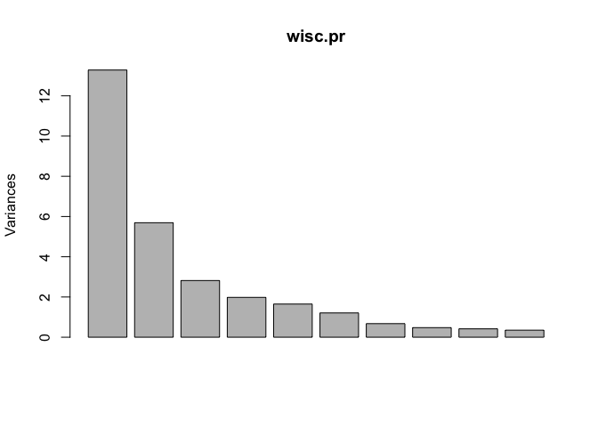
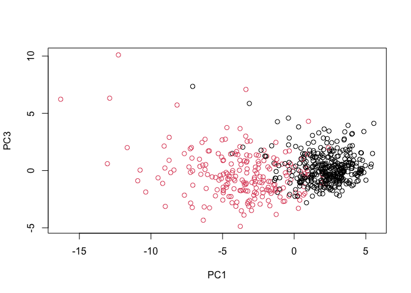
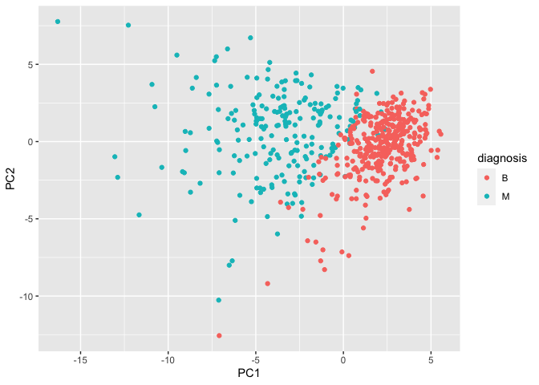
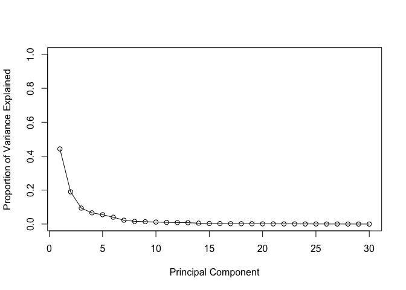
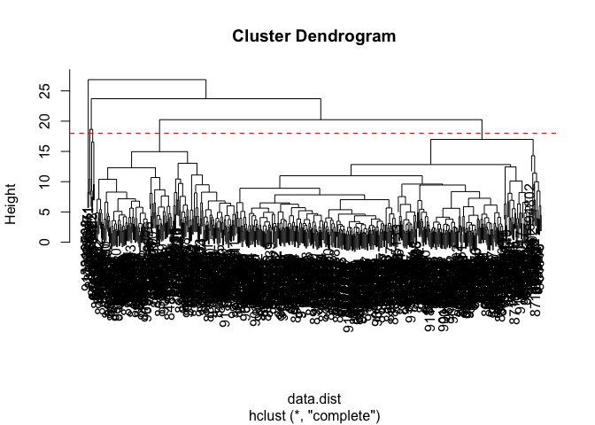
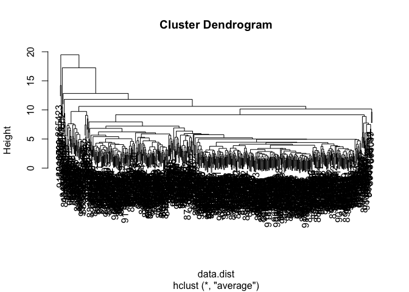
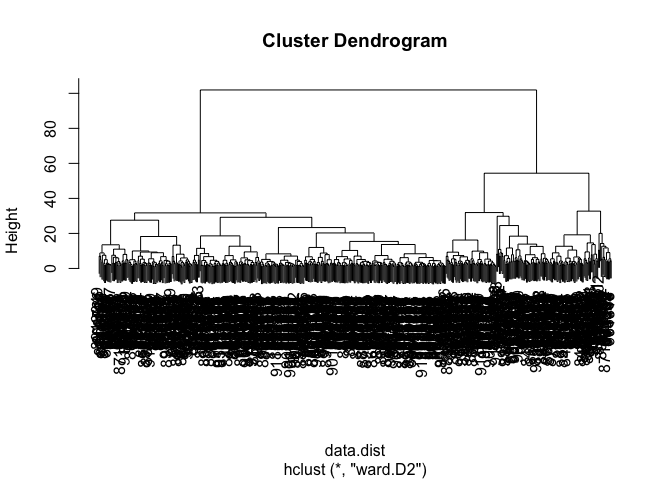
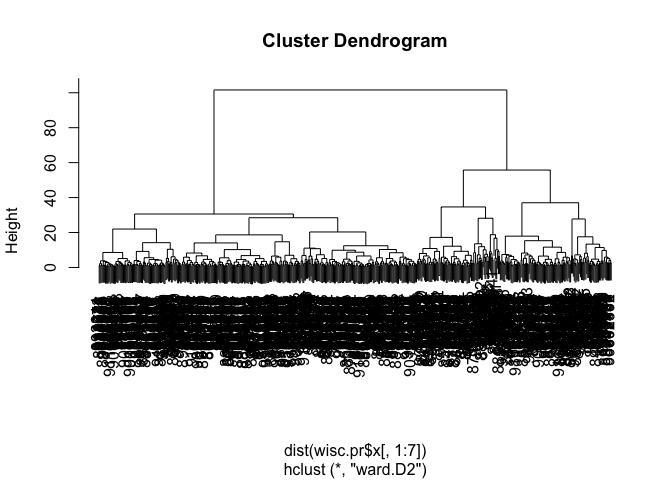
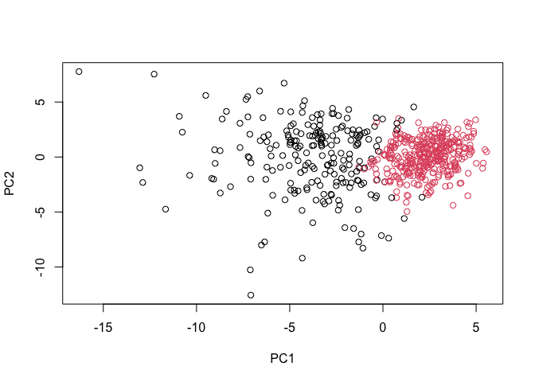
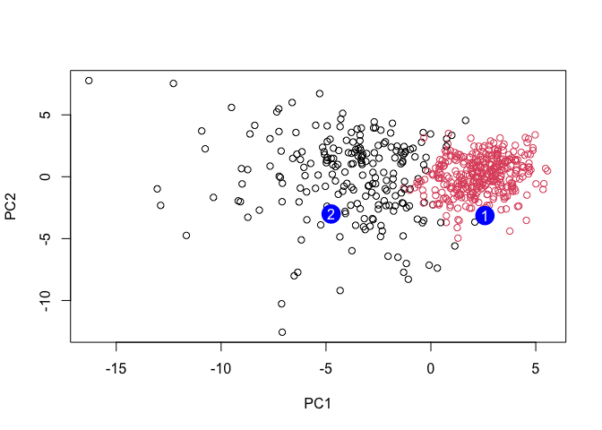

Class08
================
Dahlia Loomis
4/23/23

# 1. Exploratory Data Analysis

First, we will read the data.

``` r
setwd("/Users/dahlialoomis/Desktop/WisconsinCancer")
# Save your input data file into your Project directory
fna.data <- "WisconsinCancer.csv"
# Complete the following code to input the data and store as wisc.df
wisc.df <- read.csv(fna.data, row.names = 1)
```

Now, I am examining the data to make sure that column names are set
correctly.

``` r
head(wisc.df)
```

             diagnosis radius_mean texture_mean perimeter_mean area_mean
    842302           M       17.99        10.38         122.80    1001.0
    842517           M       20.57        17.77         132.90    1326.0
    84300903         M       19.69        21.25         130.00    1203.0
    84348301         M       11.42        20.38          77.58     386.1
    84358402         M       20.29        14.34         135.10    1297.0
    843786           M       12.45        15.70          82.57     477.1
             smoothness_mean compactness_mean concavity_mean concave.points_mean
    842302           0.11840          0.27760         0.3001             0.14710
    842517           0.08474          0.07864         0.0869             0.07017
    84300903         0.10960          0.15990         0.1974             0.12790
    84348301         0.14250          0.28390         0.2414             0.10520
    84358402         0.10030          0.13280         0.1980             0.10430
    843786           0.12780          0.17000         0.1578             0.08089
             symmetry_mean fractal_dimension_mean radius_se texture_se perimeter_se
    842302          0.2419                0.07871    1.0950     0.9053        8.589
    842517          0.1812                0.05667    0.5435     0.7339        3.398
    84300903        0.2069                0.05999    0.7456     0.7869        4.585
    84348301        0.2597                0.09744    0.4956     1.1560        3.445
    84358402        0.1809                0.05883    0.7572     0.7813        5.438
    843786          0.2087                0.07613    0.3345     0.8902        2.217
             area_se smoothness_se compactness_se concavity_se concave.points_se
    842302    153.40      0.006399        0.04904      0.05373           0.01587
    842517     74.08      0.005225        0.01308      0.01860           0.01340
    84300903   94.03      0.006150        0.04006      0.03832           0.02058
    84348301   27.23      0.009110        0.07458      0.05661           0.01867
    84358402   94.44      0.011490        0.02461      0.05688           0.01885
    843786     27.19      0.007510        0.03345      0.03672           0.01137
             symmetry_se fractal_dimension_se radius_worst texture_worst
    842302       0.03003             0.006193        25.38         17.33
    842517       0.01389             0.003532        24.99         23.41
    84300903     0.02250             0.004571        23.57         25.53
    84348301     0.05963             0.009208        14.91         26.50
    84358402     0.01756             0.005115        22.54         16.67
    843786       0.02165             0.005082        15.47         23.75
             perimeter_worst area_worst smoothness_worst compactness_worst
    842302            184.60     2019.0           0.1622            0.6656
    842517            158.80     1956.0           0.1238            0.1866
    84300903          152.50     1709.0           0.1444            0.4245
    84348301           98.87      567.7           0.2098            0.8663
    84358402          152.20     1575.0           0.1374            0.2050
    843786            103.40      741.6           0.1791            0.5249
             concavity_worst concave.points_worst symmetry_worst
    842302            0.7119               0.2654         0.4601
    842517            0.2416               0.1860         0.2750
    84300903          0.4504               0.2430         0.3613
    84348301          0.6869               0.2575         0.6638
    84358402          0.4000               0.1625         0.2364
    843786            0.5355               0.1741         0.3985
             fractal_dimension_worst
    842302                   0.11890
    842517                   0.08902
    84300903                 0.08758
    84348301                 0.17300
    84358402                 0.07678
    843786                   0.12440

``` r
#looks good. The ID is the row name 
#diagnosis is the first column
```

Now, we are removing the first diagnosis column so that it is not
present in the data set.

``` r
#Use -1 to remove the first column 
wisc.data <- wisc.df[,-1]
```

Set up a new vector called diagnosis

``` r
diagnosis <- wisc.df[,1]
diag <- as.factor(diagnosis)
```

Let’s explore the data set:

- **Q1**. How many observations are in this data set?

``` r
#we can use the nrow()
nrow(wisc.data)
```

    [1] 569

There are 569 observations.

- **Q2**. How many of the observations have a malignant diagnosis?

``` r
#We can use the table() command
table(diagnosis)
```

    diagnosis
      B   M 
    357 212 

There are 212 observations that have a malignant diagnosis.

**Q3**. How many variables/features in the data are suffixed with
`_mean`?

``` r
.mean <- grep("_mean", colnames(wisc.data))

length(.mean)
```

    [1] 10

There are 10 variables that are suffixed with \_mean.

# 2. Principal Component Analysis (PCA)

First we will check to see if the data need to be scaled before we
perform PCA.

``` r
# Check column means and standard deviations
colMeans(wisc.data)
```

                radius_mean            texture_mean          perimeter_mean 
               1.412729e+01            1.928965e+01            9.196903e+01 
                  area_mean         smoothness_mean        compactness_mean 
               6.548891e+02            9.636028e-02            1.043410e-01 
             concavity_mean     concave.points_mean           symmetry_mean 
               8.879932e-02            4.891915e-02            1.811619e-01 
     fractal_dimension_mean               radius_se              texture_se 
               6.279761e-02            4.051721e-01            1.216853e+00 
               perimeter_se                 area_se           smoothness_se 
               2.866059e+00            4.033708e+01            7.040979e-03 
             compactness_se            concavity_se       concave.points_se 
               2.547814e-02            3.189372e-02            1.179614e-02 
                symmetry_se    fractal_dimension_se            radius_worst 
               2.054230e-02            3.794904e-03            1.626919e+01 
              texture_worst         perimeter_worst              area_worst 
               2.567722e+01            1.072612e+02            8.805831e+02 
           smoothness_worst       compactness_worst         concavity_worst 
               1.323686e-01            2.542650e-01            2.721885e-01 
       concave.points_worst          symmetry_worst fractal_dimension_worst 
               1.146062e-01            2.900756e-01            8.394582e-02 

``` r
apply(wisc.data,2,sd)
```

                radius_mean            texture_mean          perimeter_mean 
               3.524049e+00            4.301036e+00            2.429898e+01 
                  area_mean         smoothness_mean        compactness_mean 
               3.519141e+02            1.406413e-02            5.281276e-02 
             concavity_mean     concave.points_mean           symmetry_mean 
               7.971981e-02            3.880284e-02            2.741428e-02 
     fractal_dimension_mean               radius_se              texture_se 
               7.060363e-03            2.773127e-01            5.516484e-01 
               perimeter_se                 area_se           smoothness_se 
               2.021855e+00            4.549101e+01            3.002518e-03 
             compactness_se            concavity_se       concave.points_se 
               1.790818e-02            3.018606e-02            6.170285e-03 
                symmetry_se    fractal_dimension_se            radius_worst 
               8.266372e-03            2.646071e-03            4.833242e+00 
              texture_worst         perimeter_worst              area_worst 
               6.146258e+00            3.360254e+01            5.693570e+02 
           smoothness_worst       compactness_worst         concavity_worst 
               2.283243e-02            1.573365e-01            2.086243e-01 
       concave.points_worst          symmetry_worst fractal_dimension_worst 
               6.573234e-02            6.186747e-02            1.806127e-02 

Since the columns are in different units, this indicates that scaling is
necessary.

Now, we will apply PCA.

**Q4**. From your results, what proportion of the original variance is
captured by the first principal components (PC1)?

``` r
wisc.pr <- prcomp(wisc.data, scale = TRUE)

summary(wisc.pr)
```

    Importance of components:
                              PC1    PC2     PC3     PC4     PC5     PC6     PC7
    Standard deviation     3.6444 2.3857 1.67867 1.40735 1.28403 1.09880 0.82172
    Proportion of Variance 0.4427 0.1897 0.09393 0.06602 0.05496 0.04025 0.02251
    Cumulative Proportion  0.4427 0.6324 0.72636 0.79239 0.84734 0.88759 0.91010
                               PC8    PC9    PC10   PC11    PC12    PC13    PC14
    Standard deviation     0.69037 0.6457 0.59219 0.5421 0.51104 0.49128 0.39624
    Proportion of Variance 0.01589 0.0139 0.01169 0.0098 0.00871 0.00805 0.00523
    Cumulative Proportion  0.92598 0.9399 0.95157 0.9614 0.97007 0.97812 0.98335
                              PC15    PC16    PC17    PC18    PC19    PC20   PC21
    Standard deviation     0.30681 0.28260 0.24372 0.22939 0.22244 0.17652 0.1731
    Proportion of Variance 0.00314 0.00266 0.00198 0.00175 0.00165 0.00104 0.0010
    Cumulative Proportion  0.98649 0.98915 0.99113 0.99288 0.99453 0.99557 0.9966
                              PC22    PC23   PC24    PC25    PC26    PC27    PC28
    Standard deviation     0.16565 0.15602 0.1344 0.12442 0.09043 0.08307 0.03987
    Proportion of Variance 0.00091 0.00081 0.0006 0.00052 0.00027 0.00023 0.00005
    Cumulative Proportion  0.99749 0.99830 0.9989 0.99942 0.99969 0.99992 0.99997
                              PC29    PC30
    Standard deviation     0.02736 0.01153
    Proportion of Variance 0.00002 0.00000
    Cumulative Proportion  1.00000 1.00000

From the summary function, the proportion of the original variance
captured by PC1 was 0.4427.

**Q5**. How many principal components (PCs) are required to describe at
least 70% of the original variance in the data?

We need three PCs to describe at least 70 percent of the data.

``` r
pca.var <- wisc.pr$sdev^2
pca.var.per <- round(pca.var/sum(pca.var)*100, 1)
pca.var.per[1]
```

    [1] 44.3

``` r
pca.var.per[1]
```

    [1] 44.3

``` r
pca.var.per[1] + pca.var.per[2]
```

    [1] 63.3

``` r
pca.var.per[1] + pca.var.per[2] + pca.var.per[3]
```

    [1] 72.7

``` r
#sum = 0
#for (i in 1:length(pca.var.per)){
 # add = pca.var.per[i]
#  sum = sum + add
#  if (sum > 0.7) {
 #   print(i)
#  }
#}
```

**Q6**. How many principal components (PCs) are required to describe at
least 90% of the original variance in the data?

7 PCs are required to describe at least 90% of the original variance in
the data.

### Interpreting PCA Results

**Q7.** What stands out to you about this plot? Is it easy or difficult
to understand? Why?

``` r
plot(wisc.pr) #generates a barplot, which is not what I want
```



``` r
biplot(wisc.pr)
```


What stands out about the plot is that there are two main grouping
representing the malignant and benevolent tumors in the different
colors. This graph is very difficult to read. There is too much overlap
and noise because it shows all of the different rows at once. We are not
able to see which values are which.

``` r
plot(wisc.pr$x[,1:2], col = diag, xlab = "PC1", ylab = "PC2")
```


**Q8.** Generate a similar plot for principal components 1 and 3. What
do you notice about these plots?

There are two main clusters representing the benign and malevolent
tumors. It is a lot more organized and we can more easily see what is
going on.

``` r
plot(wisc.pr$x[,1], wisc.pr$x[,3], col = diag, xlab = "PC1", ylab = "PC3")
```



Next, we will basically recreate this but use ggplot2.

``` r
# Create a data.frame for ggplot
df <- as.data.frame(wisc.pr$x)
df$diagnosis <- diagnosis

# Load the ggplot2 package
library(ggplot2)

# Make a scatter plot colored by diagnosis
ggplot(df) + 
  aes(PC1, PC2, col= diagnosis) + 
  geom_point()
```



### Variance Explained

First we will calculate the variance explained by each principal
component.

``` r
pr.var <- wisc.pr$sdev^2
head(pr.var)
```

    [1] 13.281608  5.691355  2.817949  1.980640  1.648731  1.207357

Next, I am calculating the variance explained by each principal
component.

``` r
# Variance explained by each principal component: pve
pve <- pr.var / sum(pr.var) 

# Plot variance explained for each principal component
plot(pve, xlab = "Principal Component", 
     ylab = "Proportion of Variance Explained", 
     ylim = c(0, 1), type = "o")
```



### Communicating PCA Results

**Q9.** For the first principal component, what is the component of the
loading vector (i.e. `wisc.pr$rotation[,1]`) for the feature
`concave.points_mean`? This tells us how much this original feature
contributes to the first PC.

``` r
sorted <- sort(wisc.pr$rotation[,1])
#barplot(sorted)
sorted
```

        concave.points_mean          concavity_mean    concave.points_worst 
                -0.26085376             -0.25840048             -0.25088597 
           compactness_mean         perimeter_worst         concavity_worst 
                -0.23928535             -0.23663968             -0.22876753 
               radius_worst          perimeter_mean              area_worst 
                -0.22799663             -0.22753729             -0.22487053 
                  area_mean             radius_mean            perimeter_se 
                -0.22099499             -0.21890244             -0.21132592 
          compactness_worst               radius_se                 area_se 
                -0.21009588             -0.20597878             -0.20286964 
          concave.points_se          compactness_se            concavity_se 
                -0.18341740             -0.17039345             -0.15358979 
            smoothness_mean           symmetry_mean fractal_dimension_worst 
                -0.14258969             -0.13816696             -0.13178394 
           smoothness_worst          symmetry_worst           texture_worst 
                -0.12795256             -0.12290456             -0.10446933 
               texture_mean    fractal_dimension_se  fractal_dimension_mean 
                -0.10372458             -0.10256832             -0.06436335 
                symmetry_se              texture_se           smoothness_se 
                -0.04249842             -0.01742803             -0.01453145 

    -0.26085376

# 3. Hierarchical Clustering

Here, I am scaling the wisc.data data

``` r
# Scale the wisc.data data using the "scale()" function
data.scaled <- scale(wisc.data)
```

Now, we need to calculate the Euclidean distances between all of the
pairs of observations in the data set we just scaled.

``` r
#dist() function shows all the Euclidean distances.
data.dist <- dist(data.scaled)
#data.dist
```

Now, we need to create a hierarchical clustering model using the
complete linkage. We will apply the hclust() argument and assign this to
wisc.hclust

``` r
wisc.hclust <- hclust(data.dist, method = "complete")

#wisc.hclust
```

## Results of Hierarchical Clustering

**Q10.** Using the `plot()` and `abline()` functions, what is the height
at which the clustering model has 4 clusters?

The height at which the clustering model has 4 groups is h = 18 (see
code and graph)

``` r
plot(wisc.hclust)
abline(wisc.hclust, col = "red", lty = 2, h = 18)
```



### Using Different Methods

**Q12.** Which method gives your favorite results for the same
`data.dist` dataset? Explain your reasoning.

Let’s try out the different results. We tried `"complete"` before, so
now let’s try `"average"` and `"ward.D2"`

This is what average looks like:

``` r
#average
wisc.hclust.average <- hclust(data.dist, method = "average")
plot(wisc.hclust.average)
```



This is what ward.D2 looks like:

``` r
#ward.D2
wisc.hclust.ward.D2 <- hclust(data.dist, method = "ward.D2")
plot(wisc.hclust.ward.D2)
```



I think I like ward.D2 the best as well. The other ones look less
organized and you have to stare at them for longer in order to figure
out what is going on since there are so many branches that go off from
the top into other groups. ward.D2 on the other hand has one large, main
branch at the top that separates into two obvious groups. It is a lot
nicer for pattern recognition and feels more organized.

# 4. Combining Methods

### Clustering on PCA Results

We will need to create a hierarchical clustering model using
`method = "ward.D2".`

``` r
wisc.pr.hclust <- hclust(dist(wisc.pr$x[,1:7]), method = "ward.D2")
plot(wisc.pr.hclust)
```



Let’s find out if these two groups of clusters in this dendrogram are
malignant or benign:

``` r
grps <- cutree(wisc.pr.hclust, k=2)
table(grps)
```

    grps
      1   2 
    216 353 

``` r
table(grps, diagnosis)
```

        diagnosis
    grps   B   M
       1  28 188
       2 329  24

To have a visual representation, let’s make a plot where the two
different groups are shown in different colors, black and red.

``` r
plot(wisc.pr$x[,1:2], col=grps)
```



``` r
plot(wisc.pr$x[,1:2], col=diag)
```


Now, let’s cut the hierarchical clustering model into 2 clusters and
assign the results to wisc.pr.hclust.clusters

``` r
wisc.pr.hclust.clusters<- cutree(wisc.pr.hclust, k=2)

table(wisc.pr.hclust.clusters, diag)
```

                           diag
    wisc.pr.hclust.clusters   B   M
                          1  28 188
                          2 329  24

**Q13.** How well does the newly created model with four clusters
separate out the two diagnoses?

I think it did a pretty good job for two clusters. In cluster 1, there
are 28 benevolent diagnoses and 188 malignant, so it is mostly
malevolent. In the second cluster, there are 329 benevolent diagnoses
and 24 malignant diagnoses. There is a majority of one diagnoses in each
and not too many points that are far off.

For four clusters, I will use the table() function to compare:

``` r
wisc.pr.hclust.clusters.4 <- cutree(wisc.hclust, k=4)

table(wisc.pr.hclust.clusters.4, diag)
```

                             diag
    wisc.pr.hclust.clusters.4   B   M
                            1  12 165
                            2   2   5
                            3 343  40
                            4   0   2

Again, it looks like it did a good job. Clusters 2 and 4 are very tiny
though. I feel like the results were more accurate when k=2 .

**Q14**. How well do the hierarchical clustering models you created in
previous sections (i.e. before PCA) do in terms of separating the
diagnoses? Again, use the `table()` function to compare the output of
each model (`wisc.km$cluster` and `wisc.hclust.clusters`) with the
vector containing the actual diagnoses.

``` r
table(wisc.pr.hclust.clusters.4, diag)
```

                             diag
    wisc.pr.hclust.clusters.4   B   M
                            1  12 165
                            2   2   5
                            3 343  40
                            4   0   2

…and compare that to the kmeans model for the clusters subset:

``` r
wisc.km.4 <- kmeans(wisc.data, centers = 4)
table(wisc.km.4$cluster, diag)
```

       diag
          B   M
      1   1 100
      2  94  87
      3 262   6
      4   0  19

Before PCA, the hierarchical clustering model did not do as well in
separating out the diagnoses. We definitely see better grouping when PCA
is combined with hierarchical cluster modeling.

# 6. Prediction

``` r
#url <- "new_samples.csv"
url <- "https://tinyurl.com/new-samples-CSV"
new <- read.csv(url)
npc <- predict(wisc.pr, newdata=new)
npc
```

               PC1       PC2        PC3        PC4       PC5        PC6        PC7
    [1,]  2.576616 -3.135913  1.3990492 -0.7631950  2.781648 -0.8150185 -0.3959098
    [2,] -4.754928 -3.009033 -0.1660946 -0.6052952 -1.140698 -1.2189945  0.8193031
                PC8       PC9       PC10      PC11      PC12      PC13     PC14
    [1,] -0.2307350 0.1029569 -0.9272861 0.3411457  0.375921 0.1610764 1.187882
    [2,] -0.3307423 0.5281896 -0.4855301 0.7173233 -1.185917 0.5893856 0.303029
              PC15       PC16        PC17        PC18        PC19       PC20
    [1,] 0.3216974 -0.1743616 -0.07875393 -0.11207028 -0.08802955 -0.2495216
    [2,] 0.1299153  0.1448061 -0.40509706  0.06565549  0.25591230 -0.4289500
               PC21       PC22       PC23       PC24        PC25         PC26
    [1,]  0.1228233 0.09358453 0.08347651  0.1223396  0.02124121  0.078884581
    [2,] -0.1224776 0.01732146 0.06316631 -0.2338618 -0.20755948 -0.009833238
                 PC27        PC28         PC29         PC30
    [1,]  0.220199544 -0.02946023 -0.015620933  0.005269029
    [2,] -0.001134152  0.09638361  0.002795349 -0.019015820

``` r
plot(wisc.pr$x[,1:2], col=grps)
points(npc[,1], npc[,2], col="blue", pch=16, cex=3)
text(npc[,1], npc[,2], c(1,2), col="white")
```



- **Q16.** Which of these new patients should we prioritize for follow
  up based on your results?

  Based on the results, we should prioritize patient 2 because this
  patient lies in the malevolent cluster and is therefore more likely to
  have a malevolent tumor that needs more rapid medical attention.
  Meanwhile, patient 1 lies in the benevolent cluster and is therefore
  less likely to need rapid medical attention if the clustering is
  accurate and the prediction holds true.
