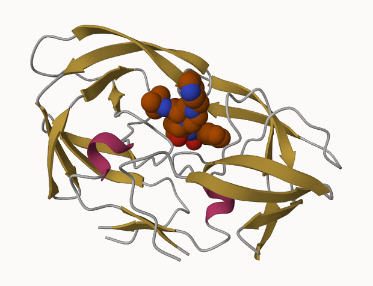
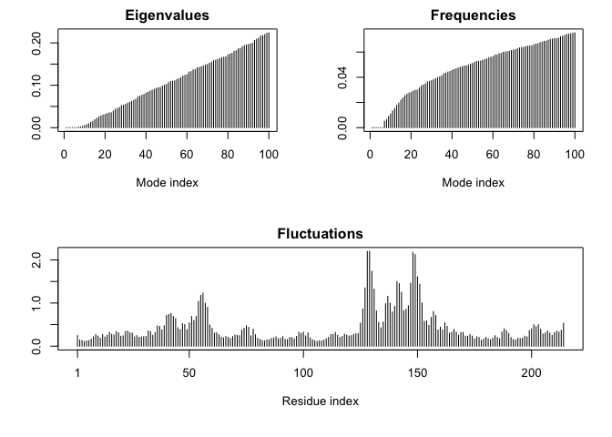

Class 09
================
Dahlia Loomis
5/3/23

# 1. Introduction to RCSB Protein Data Bank (PDB)

First, we need to read the data using the command `read.csv`:

``` r
read.csv('Data Export Summary.csv')
```

               Molecular.Type   X.ray     EM    NMR Multiple.methods Neutron Other
    1          Protein (only) 154,766 10,155 12,187              191      72    32
    2 Protein/Oligosaccharide   9,083  1,802     32                7       1     0
    3              Protein/NA   8,110  3,176    283                6       0     0
    4     Nucleic acid (only)   2,664     94  1,450               12       2     1
    5                   Other     163      9     32                0       0     0
    6  Oligosaccharide (only)      11      0      6                1       0     4
        Total
    1 177,403
    2  10,925
    3  11,575
    4   4,223
    5     204
    6      22

``` r
PDB.data <- read.csv('Data Export Summary.csv', row.names = 1)
```

**Q1**. What percentage of structures in the PDB are solved by X-Ray and
Electron Microscopy?

I need to sum all the elements of the X.ray column, but R does not read
the values as numbers since they have commas.

``` r
#with commas, R does not understand that these are numbers 
PDB.data$X.ray
```

    [1] "154,766" "9,083"   "8,110"   "2,664"   "163"     "11"     

In order to remove the commas, we will use the `gsub` function. We also
need to read the numbers as a numeric using the `as.numeric()` function

``` r
as.numeric(gsub(',', '', PDB.data$X.ray))
```

    [1] 154766   9083   8110   2664    163     11

Now, we can take the sum:

``` r
n.Xray <- sum(as.numeric(gsub(',', '', PDB.data$X.ray)))

n.EM <- sum(as.numeric(gsub(',', '', PDB.data$EM)))

n.total <- sum(as.numeric(gsub(',', '', PDB.data$Total)))

p_xray_em <- ((n.Xray + n.EM)/ n.total) *100

p_xray_em
```

    [1] 92.99297

#### The answer is 93 percent.

**Q2:** What proportion of structures in the PDB are protein?

``` r
n.proteins <- sum(as.numeric(gsub(',', '', PDB.data[1,7])))
n.proteins
```

    [1] 177403

``` r
prop_proteins <- n.proteins/n.total

prop_proteins
```

    [1] 0.8681246

#### 0.868

**Q3:** Type HIV in the PDB website search box on the home page and
determine how many HIV-1 protease structures are in the current PDB?

#### We found 2,003 protease structures in the current PDB, but it was difficult to find the actual number of structures.

# 2. Visualizing the HIV-1 Protease Structure

**Q4**: Water molecules normally have 3 atoms. Why do we see just one
atom per water molecule in this structure?

#### It simplifies it to one atom. If you hover over a water molecule, it says it is an O atom. It only shows the main molecule to avoid complexity and allow the structure to be viewed more easily in a more organized way.

**Q5**: There is a critical “conserved” water molecule in the binding
site. Can you identify this water molecule? What residue number does
this water molecule have

#### HOH 308

**Q6**: Generate and save a figure clearly showing the two distinct
chains of HIV-protease along with the ligand. You might also consider
showing the catalytic residues ASP 25 in each chain and the critical
water (we recommend *“Ball & Stick”* for these side-chains). Add this
figure to your Quarto document.



.png)

**Discussion Topic:** Can you think of a way in which indinavir, or even
larger ligands and substrates, could enter the binding site?

# 3. Introduction to Bio3D in R

``` r
library(bio3d)

pdb <- read.pdb("1hsg")
```

      Note: Accessing on-line PDB file

``` r
pdb
```


     Call:  read.pdb(file = "1hsg")

       Total Models#: 1
         Total Atoms#: 1686,  XYZs#: 5058  Chains#: 2  (values: A B)

         Protein Atoms#: 1514  (residues/Calpha atoms#: 198)
         Nucleic acid Atoms#: 0  (residues/phosphate atoms#: 0)

         Non-protein/nucleic Atoms#: 172  (residues: 128)
         Non-protein/nucleic resid values: [ HOH (127), MK1 (1) ]

       Protein sequence:
          PQITLWQRPLVTIKIGGQLKEALLDTGADDTVLEEMSLPGRWKPKMIGGIGGFIKVRQYD
          QILIEICGHKAIGTVLVGPTPVNIIGRNLLTQIGCTLNFPQITLWQRPLVTIKIGGQLKE
          ALLDTGADDTVLEEMSLPGRWKPKMIGGIGGFIKVRQYDQILIEICGHKAIGTVLVGPTP
          VNIIGRNLLTQIGCTLNF

    + attr: atom, xyz, seqres, helix, sheet,
            calpha, remark, call

``` r
attributes(pdb)
```

    $names
    [1] "atom"   "xyz"    "seqres" "helix"  "sheet"  "calpha" "remark" "call"  

    $class
    [1] "pdb" "sse"

**Q7.** How many animal acid residues are there in this pdb object?

#### There are 198 residues

**Q8.** Name one of the two non-protein residues.

#### HOH and MK1

**Q9.** How many protein chains are in this structure?

#### There are two protein chains

``` r
head(pdb$atom)
```

      type eleno elety  alt resid chain resno insert      x      y     z o     b
    1 ATOM     1     N <NA>   PRO     A     1   <NA> 29.361 39.686 5.862 1 38.10
    2 ATOM     2    CA <NA>   PRO     A     1   <NA> 30.307 38.663 5.319 1 40.62
    3 ATOM     3     C <NA>   PRO     A     1   <NA> 29.760 38.071 4.022 1 42.64
    4 ATOM     4     O <NA>   PRO     A     1   <NA> 28.600 38.302 3.676 1 43.40
    5 ATOM     5    CB <NA>   PRO     A     1   <NA> 30.508 37.541 6.342 1 37.87
    6 ATOM     6    CG <NA>   PRO     A     1   <NA> 29.296 37.591 7.162 1 38.40
      segid elesy charge
    1  <NA>     N   <NA>
    2  <NA>     C   <NA>
    3  <NA>     C   <NA>
    4  <NA>     O   <NA>
    5  <NA>     C   <NA>
    6  <NA>     C   <NA>

## Predicting Function Motions of a Single Structure by NMA

``` r
adk <- read.pdb('6s36')
```

      Note: Accessing on-line PDB file
       PDB has ALT records, taking A only, rm.alt=TRUE

``` r
adk
```


     Call:  read.pdb(file = "6s36")

       Total Models#: 1
         Total Atoms#: 1898,  XYZs#: 5694  Chains#: 1  (values: A)

         Protein Atoms#: 1654  (residues/Calpha atoms#: 214)
         Nucleic acid Atoms#: 0  (residues/phosphate atoms#: 0)

         Non-protein/nucleic Atoms#: 244  (residues: 244)
         Non-protein/nucleic resid values: [ CL (3), HOH (238), MG (2), NA (1) ]

       Protein sequence:
          MRIILLGAPGAGKGTQAQFIMEKYGIPQISTGDMLRAAVKSGSELGKQAKDIMDAGKLVT
          DELVIALVKERIAQEDCRNGFLLDGFPRTIPQADAMKEAGINVDYVLEFDVPDELIVDKI
          VGRRVHAPSGRVYHVKFNPPKVEGKDDVTGEELTTRKDDQEETVRKRLVEYHQMTAPLIG
          YYSKEAEAGNTKYAKVDGTKPVAEVRADLEKILG

    + attr: atom, xyz, seqres, helix, sheet,
            calpha, remark, call

Now, we will perform normal mode analysis (NMA) to predict protein
flexibility and potential functional motions

``` r
m <- nma(adk)
```

     Building Hessian...        Done in 0.03 seconds.
     Diagonalizing Hessian...   Done in 0.407 seconds.

``` r
plot(m)
```



``` r
#fluctuations are the amounts of flexibility 
#corresponding to particular amino acids. 
```

``` r
mktrj(m, file = "adk_m7.pdb")
```
