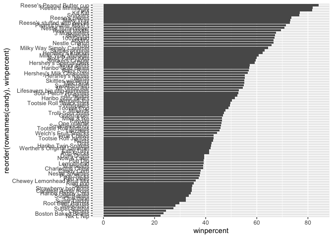

Class 10: Halloween Candy Mini Project
================
Dahlia Loomis
5/5/23

# 1. Importing Candy Data

First, we need to tell R to read the 538 candy dataset. I am going to do
this using the URL.

``` r
url <- "https://raw.githubusercontent.com/fivethirtyeight/data/master/candy-power-ranking/candy-data.csv"

candy <- read.csv(url, row.names = 1)

head(candy)
```

                 chocolate fruity caramel peanutyalmondy nougat crispedricewafer
    100 Grand            1      0       1              0      0                1
    3 Musketeers         1      0       0              0      1                0
    One dime             0      0       0              0      0                0
    One quarter          0      0       0              0      0                0
    Air Heads            0      1       0              0      0                0
    Almond Joy           1      0       0              1      0                0
                 hard bar pluribus sugarpercent pricepercent winpercent
    100 Grand       0   1        0        0.732        0.860   66.97173
    3 Musketeers    0   1        0        0.604        0.511   67.60294
    One dime        0   0        0        0.011        0.116   32.26109
    One quarter     0   0        0        0.011        0.511   46.11650
    Air Heads       0   0        0        0.906        0.511   52.34146
    Almond Joy      0   1        0        0.465        0.767   50.34755

**Q1. How many different candy types are in this dataset?**

``` r
dim(candy)
```

    [1] 85 12

There are 85 different types of candy in this dataset.

**Q2. How many fruity candy types are in the dataset?**

According to the dataset, if a candy is considered fruity, it has a
score of 1. If it is not, it has a score of 0; therefore, if we use the
sum function and take the sum of the fruity column, we can find the
total number of candies that are considered fruity.

``` r
sum(candy$fruity)
```

    [1] 38

There are 38 fruity candy types in the dataset.

# 2. What is your Favorite Candy?

#### Winpercent

The variable `winpercent` is the percentage of people who prefer this
candy over another randomly chosen candy in the dataset.

We can find the winpercent value for Twix using the following code:

``` r
candy["Twix", ]$winpercent
```

    [1] 81.64291

**Q3. What is your favorite candy in the dataset and what is it’s
winpercent value?**

My favorite candy in the dataset is Fun Dip.

``` r
candy["Fun Dip",]$winpercent
```

    [1] 39.1855

According to the code, its winpercent value is 39.19%

**Q4. What is the winpercent value for “Kit Kat”?**

``` r
candy["Kit Kat",]$winpercent
```

    [1] 76.7686

The winpercent value for Kit Kat is 76.77%

**Q5. What is the winpercent value for “Tootsie Roll Snack Bars”?**

``` r
candy["Tootsie Roll Snack Bars",]$winpercent
```

    [1] 49.6535

The winpercent value for Tootsie Roll Snack Bars is 49.65%

#### skimr Package

Next, we will explore the dataset by using the skimr package. It is not
installed on my RStudio yet, so I will need to install it.

``` r
#install.packages("skimr")
library("skimr")
skim(candy)
```

|                                                  |       |
|:-------------------------------------------------|:------|
| Name                                             | candy |
| Number of rows                                   | 85    |
| Number of columns                                | 12    |
| \_\_\_\_\_\_\_\_\_\_\_\_\_\_\_\_\_\_\_\_\_\_\_   |       |
| Column type frequency:                           |       |
| numeric                                          | 12    |
| \_\_\_\_\_\_\_\_\_\_\_\_\_\_\_\_\_\_\_\_\_\_\_\_ |       |
| Group variables                                  | None  |

Data summary

**Variable type: numeric**

| skim_variable    | n_missing | complete_rate |  mean |    sd |    p0 |   p25 |   p50 |   p75 |  p100 | hist  |
|:-----------------|----------:|--------------:|------:|------:|------:|------:|------:|------:|------:|:------|
| chocolate        |         0 |             1 |  0.44 |  0.50 |  0.00 |  0.00 |  0.00 |  1.00 |  1.00 | ▇▁▁▁▆ |
| fruity           |         0 |             1 |  0.45 |  0.50 |  0.00 |  0.00 |  0.00 |  1.00 |  1.00 | ▇▁▁▁▆ |
| caramel          |         0 |             1 |  0.16 |  0.37 |  0.00 |  0.00 |  0.00 |  0.00 |  1.00 | ▇▁▁▁▂ |
| peanutyalmondy   |         0 |             1 |  0.16 |  0.37 |  0.00 |  0.00 |  0.00 |  0.00 |  1.00 | ▇▁▁▁▂ |
| nougat           |         0 |             1 |  0.08 |  0.28 |  0.00 |  0.00 |  0.00 |  0.00 |  1.00 | ▇▁▁▁▁ |
| crispedricewafer |         0 |             1 |  0.08 |  0.28 |  0.00 |  0.00 |  0.00 |  0.00 |  1.00 | ▇▁▁▁▁ |
| hard             |         0 |             1 |  0.18 |  0.38 |  0.00 |  0.00 |  0.00 |  0.00 |  1.00 | ▇▁▁▁▂ |
| bar              |         0 |             1 |  0.25 |  0.43 |  0.00 |  0.00 |  0.00 |  0.00 |  1.00 | ▇▁▁▁▂ |
| pluribus         |         0 |             1 |  0.52 |  0.50 |  0.00 |  0.00 |  1.00 |  1.00 |  1.00 | ▇▁▁▁▇ |
| sugarpercent     |         0 |             1 |  0.48 |  0.28 |  0.01 |  0.22 |  0.47 |  0.73 |  0.99 | ▇▇▇▇▆ |
| pricepercent     |         0 |             1 |  0.47 |  0.29 |  0.01 |  0.26 |  0.47 |  0.65 |  0.98 | ▇▇▇▇▆ |
| winpercent       |         0 |             1 | 50.32 | 14.71 | 22.45 | 39.14 | 47.83 | 59.86 | 84.18 | ▃▇▆▅▂ |

**Q6. Is there any variable/column that looks to be on a different scale
to the majority of the other columns in the dataset?**

Yes. The n_missing column and the complete_rate column stand out since
they only have values of 0 or 1, respectively. All the rest of the
values are on a proportional scale and vary as you go down the column.

**Q7. What do you think a zero and one represent for the
candy\$chocolate column?**

A zero seems to represent that the candy type was not described by that
variable. For example, Air Heads received a zero since they do not
contain chocolate. A one represents that the candy does contain
chocolate.

#### Creating a Histogram

I will use ggplot to make a histogram of the winpercent values and
analyze the histogram

**Q8. Plot a histogram of the winpercent values**

``` r
library(ggplot2)
ggplot(candy, aes(x = winpercent)) + geom_histogram()
```

    `stat_bin()` using `bins = 30`. Pick better value with `binwidth`.


**Q9. Is the distribution of winpercent values symmetrical?**

I would say that it is relatively symmetrical. If I’m being picky, there
could be a slight skew to the right.

**Q10. Is the center of the distribution above or below 50%?**

The center of the distribution is a little above 50%.

**Q11. On average, is chocolate candy higher or lower ranked than fruit
candy?**

For this question, we can use the `as.logical` function and then take
the mean of the winpercent values for chocolate and for fruity candy and
compare them to each other.

``` r
#chocolate
mean(candy$winpercent[as.logical(candy$chocolate)])
```

    [1] 60.92153

``` r
#fruity
mean(candy$winpercent[as.logical(candy$fruity)])
```

    [1] 44.11974

On average, chocolate candy is ranked higher since these candies have an
average winpercent value of 61 percent while fruity candies have an
average winpercent value of 44 percent.

**Q12. Is this difference statistically significant?**

To answer, this question, we will need to use a Welch’s Two Sample
T-Test on vectors of the two candy types we are trying to compare
(fruity and chocolate) using the `t.test()` function.

``` r
chocolate <- (candy$winpercent[as.logical(candy$chocolate)])
fruity <- (candy$winpercent[as.logical(candy$fruity)])
t.test(chocolate, fruity)
```


        Welch Two Sample t-test

    data:  chocolate and fruity
    t = 6.2582, df = 68.882, p-value = 2.871e-08
    alternative hypothesis: true difference in means is not equal to 0
    95 percent confidence interval:
     11.44563 22.15795
    sample estimates:
    mean of x mean of y 
     60.92153  44.11974 

The null hypothesis for a two-sample t-test is that the groups have
equal means and there is no difference between them. Since we got a very
small p-value (2.87E-8), we can reject this hypothesis at the 0.01
significance level. This indicates that there is a significant
difference in the winpercent values for the fruity and chocolate candy
types and we reject the null.

# 3. Overall Candy Rankings

#### Determining Favorite and Least Favorite Candies

We will determine which candies have the highest and lowest winpercent
values, using the `order()` function as well as the `head()` function.

``` r
head(candy[order(candy$winpercent),], n = 5)
```

                       chocolate fruity caramel peanutyalmondy nougat
    Nik L Nip                  0      1       0              0      0
    Boston Baked Beans         0      0       0              1      0
    Chiclets                   0      1       0              0      0
    Super Bubble               0      1       0              0      0
    Jawbusters                 0      1       0              0      0
                       crispedricewafer hard bar pluribus sugarpercent pricepercent
    Nik L Nip                         0    0   0        1        0.197        0.976
    Boston Baked Beans                0    0   0        1        0.313        0.511
    Chiclets                          0    0   0        1        0.046        0.325
    Super Bubble                      0    0   0        0        0.162        0.116
    Jawbusters                        0    1   0        1        0.093        0.511
                       winpercent
    Nik L Nip            22.44534
    Boston Baked Beans   23.41782
    Chiclets             24.52499
    Super Bubble         27.30386
    Jawbusters           28.12744

``` r
tail(candy[order(candy$winpercent),], n = 5)
```

                              chocolate fruity caramel peanutyalmondy nougat
    Snickers                          1      0       1              1      1
    Kit Kat                           1      0       0              0      0
    Twix                              1      0       1              0      0
    Reese's Miniatures                1      0       0              1      0
    Reese's Peanut Butter cup         1      0       0              1      0
                              crispedricewafer hard bar pluribus sugarpercent
    Snickers                                 0    0   1        0        0.546
    Kit Kat                                  1    0   1        0        0.313
    Twix                                     1    0   1        0        0.546
    Reese's Miniatures                       0    0   0        0        0.034
    Reese's Peanut Butter cup                0    0   0        0        0.720
                              pricepercent winpercent
    Snickers                         0.651   76.67378
    Kit Kat                          0.511   76.76860
    Twix                             0.906   81.64291
    Reese's Miniatures               0.279   81.86626
    Reese's Peanut Butter cup        0.651   84.18029

This can also be done using the dplyr package

``` r
library(dplyr)
```


    Attaching package: 'dplyr'

    The following objects are masked from 'package:stats':

        filter, lag

    The following objects are masked from 'package:base':

        intersect, setdiff, setequal, union

``` r
candy %>% arrange(winpercent) %>% head(5)
```

                       chocolate fruity caramel peanutyalmondy nougat
    Nik L Nip                  0      1       0              0      0
    Boston Baked Beans         0      0       0              1      0
    Chiclets                   0      1       0              0      0
    Super Bubble               0      1       0              0      0
    Jawbusters                 0      1       0              0      0
                       crispedricewafer hard bar pluribus sugarpercent pricepercent
    Nik L Nip                         0    0   0        1        0.197        0.976
    Boston Baked Beans                0    0   0        1        0.313        0.511
    Chiclets                          0    0   0        1        0.046        0.325
    Super Bubble                      0    0   0        0        0.162        0.116
    Jawbusters                        0    1   0        1        0.093        0.511
                       winpercent
    Nik L Nip            22.44534
    Boston Baked Beans   23.41782
    Chiclets             24.52499
    Super Bubble         27.30386
    Jawbusters           28.12744

``` r
candy %>% arrange(winpercent) %>% tail(5)
```

                              chocolate fruity caramel peanutyalmondy nougat
    Snickers                          1      0       1              1      1
    Kit Kat                           1      0       0              0      0
    Twix                              1      0       1              0      0
    Reese's Miniatures                1      0       0              1      0
    Reese's Peanut Butter cup         1      0       0              1      0
                              crispedricewafer hard bar pluribus sugarpercent
    Snickers                                 0    0   1        0        0.546
    Kit Kat                                  1    0   1        0        0.313
    Twix                                     1    0   1        0        0.546
    Reese's Miniatures                       0    0   0        0        0.034
    Reese's Peanut Butter cup                0    0   0        0        0.720
                              pricepercent winpercent
    Snickers                         0.651   76.67378
    Kit Kat                          0.511   76.76860
    Twix                             0.906   81.64291
    Reese's Miniatures               0.279   81.86626
    Reese's Peanut Butter cup        0.651   84.18029

Personally, I prefer the approach that utilizes base R since I am more
familiar with it and it seems more intuitive to me.

**Q13. What are the five least liked candy types in this set?**

Nik L Nip, Boston Baked Beans, Chiclets, Super Bubble, and Jawbusters

**Q14. What are the top 5 all time favorite candy types out of this
set?**

Snickers, Kit Kat, Twix, Reese’s Miniatures, and Reese’s Peanut Butter
Cup

#### Making a Barplot to Visualize Candy Rankings

**Q15. Make a first barplot of candy ranking based on `winpercent`
values.**

``` r
library(ggplot2)
ggplot(candy) + aes(x = winpercent, rownames(candy)) + geom_bar(stat = "identity")
```


**Q16. This is quite ugly. Use the reorder() function to get the bars
sorted by winpercent.**

``` r
ggplot(candy) + aes(x = winpercent, reorder(rownames(candy), winpercent)) + geom_bar(stat = "identity")
```



#### Adding Some Color

First, we will make a vector of all of the black values then overwrite
chocolate brown and red for fruity candy.

These are the vectors:

``` r
my_cols=rep("black", nrow(candy))
my_cols[as.logical(candy$chocolate)] = "chocolate"
my_cols[as.logical(candy$bar)] = "brown"
my_cols[as.logical(candy$fruity)] = "pink"
```

Let’s add these colors onto our bar plot:

``` r
ggplot(candy) + 
  aes(winpercent, reorder(rownames(candy),winpercent)) +
  geom_col(fill=my_cols)
```


**Q17. What is the worst ranking chocolate candy?**

The worst ranked chocolate candy is Sixlets

**Q18. What is the best ranked fruity candy?**

The best ranked fruity candy is Starbursts

# 4. Taking a Look at Pricepercent

We will take a look at which is the best ranked AND cheapest candy by
plotting winpercent vs the pricepercent variable.

First, we will need to install ggrepel so that the labels on the graph
we are about to make do not overlap.

``` r
#install.packages("ggrepel")
library(ggrepel)

# How about a plot of price vs win
ggplot(candy) +
  aes(winpercent, pricepercent, label=rownames(candy)) +
  geom_point(col=my_cols) + 
  geom_text_repel(col=my_cols, size=3.3, max.overlaps = 5)
```

    Warning: ggrepel: 50 unlabeled data points (too many overlaps). Consider
    increasing max.overlaps


**Q19. Which candy type is highest ranked in terms of winpercent for the
least money (i.e. offers the most bang for your buck)?**

From the graph, it looks like it is Reese’s Miniatures since it is far
to the right, indicating it is highly ranked in terms of popularity, and
it is lower down on the y-axis, indicating a lower pricepercent value.
This means it is less expensive compared to the other candies.

**Q20. What are the top 5 most expensive candy types in the dataset and
of these, which is the least popular?**

To answer this question, we can use the `order()` function to order the
dataset by pricepercent

``` r
ord <- order(candy$pricepercent, decreasing = TRUE)
head( candy[ord,c(11,12)], n=5 )
```

                             pricepercent winpercent
    Nik L Nip                       0.976   22.44534
    Nestle Smarties                 0.976   37.88719
    Ring pop                        0.965   35.29076
    Hershey's Krackel               0.918   62.28448
    Hershey's Milk Chocolate        0.918   56.49050

``` r
ord
```

     [1] 45 63 56 24 25 26 41 80  1 39 40 57 85 50  6  7 43 44 47 71 74 33 34 37 48
    [26] 53 54 55 65 66  2  4  5  8 11 12 14 27 28 29 36 76 19 20 21 22 18 38  9 10
    [51] 13 17 35 42 46 72 75 78 83 32 52 59 84 79 61 62 69  3 30 51 64 67 68 73 81
    [76] 82 31 23 60 58 70 15 16 49 77

The top 5 most expensive candies are Nik L Nip, Nestle Smarties, Ring
Pops, Hershey’s Krackel, and Hershey’s Milk Chocolate. Nik L Nip is the
least popular.

# 5. Exploring the Correlation Structure

Now, we will use the corrplot package to plot a correlation matrix.

First, we need to install and load the package.

``` r
#install.packages("corrplot")
library(corrplot)
```

    corrplot 0.92 loaded

Now, we can make the actual plot:

``` r
cij <- cor(candy)
corrplot(cij)
```


**Q22. Examining this plot, what two variables are anti-correlated
(i.e. have minus values)?**

Fruity and chocolaty candies are anti-correlated. This indicates that
there are not a lot of candies that fall under both of these variables
simultaneously since many would agree this is not a good flavor combo.

**Q23. Similarly, what two variables are most positively correlated?**

Winpercent and chocolate are most positively correlated since there is a
positive relationship between candies containing chocolate and their
popularity. Chocolate candies tend to be the most popular and people
tend to like them the best and rank them the highest.

# 6. Principal Component Analysis

Now, we are going to apply PCA to our candy dataset by using the
`prcom()` function.

``` r
pca <- prcomp(candy, scale = TRUE)
summary(pca)
```

    Importance of components:
                              PC1    PC2    PC3     PC4    PC5     PC6     PC7
    Standard deviation     2.0788 1.1378 1.1092 1.07533 0.9518 0.81923 0.81530
    Proportion of Variance 0.3601 0.1079 0.1025 0.09636 0.0755 0.05593 0.05539
    Cumulative Proportion  0.3601 0.4680 0.5705 0.66688 0.7424 0.79830 0.85369
                               PC8     PC9    PC10    PC11    PC12
    Standard deviation     0.74530 0.67824 0.62349 0.43974 0.39760
    Proportion of Variance 0.04629 0.03833 0.03239 0.01611 0.01317
    Cumulative Proportion  0.89998 0.93832 0.97071 0.98683 1.00000

Now, we will plot PC1 vs. PC2

``` r
PC1 <- pca$x[,1]
PC2 <- pca$x[,2]
plot(x = PC1, y = PC2)
```


Let’s add some color to the plot

``` r
plot(pca$x[,1:2], col=my_cols, pch=16)
```


However, we can make a nicer plot using the ggplot2 package. But, we
will need to make a new data.frame that contains the PCA results of the
candy data. We can use the `cbind()` function.

``` r
# Make a new data-frame with our PCA results and candy data
my_data <- cbind(candy, pca$x[,1:3])

p <- ggplot(my_data) + 
        aes(x=PC1, y=PC2, 
            size=winpercent/100,  
            text=rownames(my_data),
            label=rownames(my_data)) +
        geom_point(col=my_cols)

p
```


Now, we will apply the ggrepel package and add a title, subtitle,
caption and some labels

``` r
library(ggrepel)

p + geom_text_repel(size=3.3, col=my_cols, max.overlaps = 7)  + 
  theme(legend.position = "none") +
  labs(title="Halloween Candy PCA Space",
       subtitle="Colored by type: chocolate bar (dark brown), chocolate other (light brown), fruity (red), other (black)",
       caption="Data from 538")
```

    Warning: ggrepel: 39 unlabeled data points (too many overlaps). Consider
    increasing max.overlaps


We can use the plotly package to make the plot interactive so that when
you hover over the dots, you can see their labels. First, we will need
to install it and load it into R. Then, we can apply it. (for some
reason the plotly package was not working to let me generate a pdf, so I
had to make RStudio not read the code.)

``` r
#install.packages("plotly")
#library(plotly)
#ggplotly(p)
```

Looks pretty good!

Finally, we will analyze our PCA loadings by making a barplot of the
contribution of each variable.

``` r
par(mar=c(8,4,2,2))
barplot(pca$rotation[,1], las=2, ylab="PC1 Contribution")
```


**Q24. What original variables are picked up strongly by PC1 in the
positive direction? Do these make sense to you?**

“Fruity,”Hard”, and “pluribus” candy types are picked up strongly by PC1
in the positive direction since they have the largest positive loading
scores, meaning they are highly influential in the data set. This makes
sense to me because these tended to be the traits of the lesser liked
candies, which are shown in a cluster in pink. It makes sense that they
would be influential in the positive direction since they account for a
lot of the variation.
