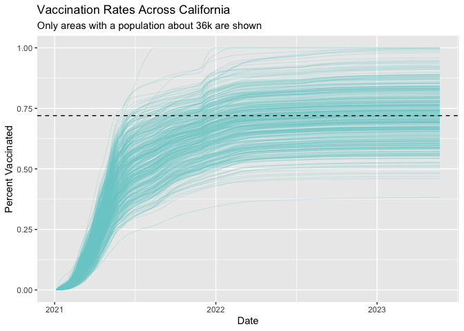

Class 17: Vaccination Rate Mini Project
================
Dahlia Loomis
5/31/23

# Class 17: Vaccination Rate Mini Project

First, import the data set:

``` r
vax <- read.csv("covid19vaccinesbyzipcode_test.csv")
head(vax)
```

      as_of_date zip_code_tabulation_area local_health_jurisdiction      county
    1 2021-01-05                    94579                   Alameda     Alameda
    2 2021-01-05                    93726                    Fresno      Fresno
    3 2021-01-05                    94305               Santa Clara Santa Clara
    4 2021-01-05                    93704                    Fresno      Fresno
    5 2021-01-05                    94403                 San Mateo   San Mateo
    6 2021-01-05                    93668                    Fresno      Fresno
      vaccine_equity_metric_quartile                 vem_source
    1                              3 Healthy Places Index Score
    2                              1 Healthy Places Index Score
    3                              4 Healthy Places Index Score
    4                              1 Healthy Places Index Score
    5                              4 Healthy Places Index Score
    6                              1    CDPH-Derived ZCTA Score
      age12_plus_population age5_plus_population tot_population
    1               19192.7                20872          21883
    2               33707.7                39067          42824
    3               15716.9                16015          16397
    4               24803.5                27701          29740
    5               37967.5                41530          44408
    6                1013.4                 1199           1219
      persons_fully_vaccinated persons_partially_vaccinated
    1                       NA                           NA
    2                       NA                           NA
    3                       NA                           NA
    4                       NA                           NA
    5                       NA                           NA
    6                       NA                           NA
      percent_of_population_fully_vaccinated
    1                                     NA
    2                                     NA
    3                                     NA
    4                                     NA
    5                                     NA
    6                                     NA
      percent_of_population_partially_vaccinated
    1                                         NA
    2                                         NA
    3                                         NA
    4                                         NA
    5                                         NA
    6                                         NA
      percent_of_population_with_1_plus_dose booster_recip_count
    1                                     NA                  NA
    2                                     NA                  NA
    3                                     NA                  NA
    4                                     NA                  NA
    5                                     NA                  NA
    6                                     NA                  NA
      bivalent_dose_recip_count eligible_recipient_count
    1                        NA                        4
    2                        NA                        2
    3                        NA                        8
    4                        NA                        5
    5                        NA                        7
    6                        NA                        0
      eligible_bivalent_recipient_count
    1                                 4
    2                                 2
    3                                 8
    4                                 5
    5                                 7
    6                                 0
                                                                   redacted
    1 Information redacted in accordance with CA state privacy requirements
    2 Information redacted in accordance with CA state privacy requirements
    3 Information redacted in accordance with CA state privacy requirements
    4 Information redacted in accordance with CA state privacy requirements
    5 Information redacted in accordance with CA state privacy requirements
    6 Information redacted in accordance with CA state privacy requirements

**Q1. What column details the total number of people fully vaccinated?**

persons_fully_vaccinated

**Q2. What column details the Zip code tabulation area?**

zip_code_tabulation_area

**Q3. What is the earliest date in this dataset?**

2021-01-05

``` r
head(vax)
```

      as_of_date zip_code_tabulation_area local_health_jurisdiction      county
    1 2021-01-05                    94579                   Alameda     Alameda
    2 2021-01-05                    93726                    Fresno      Fresno
    3 2021-01-05                    94305               Santa Clara Santa Clara
    4 2021-01-05                    93704                    Fresno      Fresno
    5 2021-01-05                    94403                 San Mateo   San Mateo
    6 2021-01-05                    93668                    Fresno      Fresno
      vaccine_equity_metric_quartile                 vem_source
    1                              3 Healthy Places Index Score
    2                              1 Healthy Places Index Score
    3                              4 Healthy Places Index Score
    4                              1 Healthy Places Index Score
    5                              4 Healthy Places Index Score
    6                              1    CDPH-Derived ZCTA Score
      age12_plus_population age5_plus_population tot_population
    1               19192.7                20872          21883
    2               33707.7                39067          42824
    3               15716.9                16015          16397
    4               24803.5                27701          29740
    5               37967.5                41530          44408
    6                1013.4                 1199           1219
      persons_fully_vaccinated persons_partially_vaccinated
    1                       NA                           NA
    2                       NA                           NA
    3                       NA                           NA
    4                       NA                           NA
    5                       NA                           NA
    6                       NA                           NA
      percent_of_population_fully_vaccinated
    1                                     NA
    2                                     NA
    3                                     NA
    4                                     NA
    5                                     NA
    6                                     NA
      percent_of_population_partially_vaccinated
    1                                         NA
    2                                         NA
    3                                         NA
    4                                         NA
    5                                         NA
    6                                         NA
      percent_of_population_with_1_plus_dose booster_recip_count
    1                                     NA                  NA
    2                                     NA                  NA
    3                                     NA                  NA
    4                                     NA                  NA
    5                                     NA                  NA
    6                                     NA                  NA
      bivalent_dose_recip_count eligible_recipient_count
    1                        NA                        4
    2                        NA                        2
    3                        NA                        8
    4                        NA                        5
    5                        NA                        7
    6                        NA                        0
      eligible_bivalent_recipient_count
    1                                 4
    2                                 2
    3                                 8
    4                                 5
    5                                 7
    6                                 0
                                                                   redacted
    1 Information redacted in accordance with CA state privacy requirements
    2 Information redacted in accordance with CA state privacy requirements
    3 Information redacted in accordance with CA state privacy requirements
    4 Information redacted in accordance with CA state privacy requirements
    5 Information redacted in accordance with CA state privacy requirements
    6 Information redacted in accordance with CA state privacy requirements

**Q4. What is the latest date in the dataset?**

``` r
tail(vax)
```

           as_of_date zip_code_tabulation_area local_health_jurisdiction
    220495 2023-05-23                    94115             San Francisco
    220496 2023-05-23                    95569                  Humboldt
    220497 2023-05-23                    95066                Santa Cruz
    220498 2023-05-23                    94109             San Francisco
    220499 2023-05-23                    91436               Los Angeles
    220500 2023-05-23                    95660                Sacramento
                  county vaccine_equity_metric_quartile                 vem_source
    220495 San Francisco                              4 Healthy Places Index Score
    220496      Humboldt                              2    CDPH-Derived ZCTA Score
    220497    Santa Cruz                              4 Healthy Places Index Score
    220498 San Francisco                              3 Healthy Places Index Score
    220499   Los Angeles                              4 Healthy Places Index Score
    220500    Sacramento                              1 Healthy Places Index Score
           age12_plus_population age5_plus_population tot_population
    220495               31607.7                33115          34604
    220496                 371.0                  371            371
    220497               13386.7                14552          15341
    220498               54825.4                55801          57302
    220499               13239.4                14702          15292
    220500               28607.4                32771          35461
           persons_fully_vaccinated persons_partially_vaccinated
    220495                    29737                         3369
    220496                      105                           14
    220497                    12556                          878
    220498                    44899                         5928
    220499                    13205                         1160
    220500                    17919                         2040
           percent_of_population_fully_vaccinated
    220495                               0.859352
    220496                               0.283019
    220497                               0.818460
    220498                               0.783550
    220499                               0.863523
    220500                               0.505316
           percent_of_population_partially_vaccinated
    220495                                   0.097359
    220496                                   0.037736
    220497                                   0.057232
    220498                                   0.103452
    220499                                   0.075857
    220500                                   0.057528
           percent_of_population_with_1_plus_dose booster_recip_count
    220495                               0.956711               23595
    220496                               0.320755                  62
    220497                               0.875692                9147
    220498                               0.887002               34844
    220499                               0.939380                9632
    220500                               0.562844                8625
           bivalent_dose_recip_count eligible_recipient_count
    220495                     13064                    29606
    220496                        31                      105
    220497                      5042                    12522
    220498                     18942                    44773
    220499                      5133                    13150
    220500                      3130                    17886
           eligible_bivalent_recipient_count redacted
    220495                             29606       No
    220496                                 0       No
    220497                             12522       No
    220498                             44773       No
    220499                             13150       No
    220500                             17886       No

2023-05-23

Now, we are going to use the skimr package to get an overview of the
dataset

``` r
skimr::skim_without_charts(vax)
```

|                                                  |        |
|:-------------------------------------------------|:-------|
| Name                                             | vax    |
| Number of rows                                   | 220500 |
| Number of columns                                | 19     |
| \_\_\_\_\_\_\_\_\_\_\_\_\_\_\_\_\_\_\_\_\_\_\_   |        |
| Column type frequency:                           |        |
| character                                        | 5      |
| numeric                                          | 14     |
| \_\_\_\_\_\_\_\_\_\_\_\_\_\_\_\_\_\_\_\_\_\_\_\_ |        |
| Group variables                                  | None   |

Data summary

**Variable type: character**

| skim_variable             | n_missing | complete_rate | min | max | empty | n_unique | whitespace |
|:--------------------------|----------:|--------------:|----:|----:|------:|---------:|-----------:|
| as_of_date                |         0 |             1 |  10 |  10 |     0 |      125 |          0 |
| local_health_jurisdiction |         0 |             1 |   0 |  15 |   625 |       62 |          0 |
| county                    |         0 |             1 |   0 |  15 |   625 |       59 |          0 |
| vem_source                |         0 |             1 |  15 |  26 |     0 |        3 |          0 |
| redacted                  |         0 |             1 |   2 |  69 |     0 |        2 |          0 |

**Variable type: numeric**

| skim_variable                              | n_missing | complete_rate |     mean |       sd |    p0 |      p25 |      p50 |      p75 |     p100 |
|:-------------------------------------------|----------:|--------------:|---------:|---------:|------:|---------:|---------:|---------:|---------:|
| zip_code_tabulation_area                   |         0 |          1.00 | 93665.11 |  1817.38 | 90001 | 92257.75 | 93658.50 | 95380.50 |  97635.0 |
| vaccine_equity_metric_quartile             |     10875 |          0.95 |     2.44 |     1.11 |     1 |     1.00 |     2.00 |     3.00 |      4.0 |
| age12_plus_population                      |         0 |          1.00 | 18895.04 | 18993.87 |     0 |  1346.95 | 13685.10 | 31756.12 |  88556.7 |
| age5_plus_population                       |         0 |          1.00 | 20875.24 | 21105.97 |     0 |  1460.50 | 15364.00 | 34877.00 | 101902.0 |
| tot_population                             |     10750 |          0.95 | 23372.77 | 22628.50 |    12 |  2126.00 | 18714.00 | 38168.00 | 111165.0 |
| persons_fully_vaccinated                   |     17711 |          0.92 | 14272.72 | 15264.17 |    11 |   954.00 |  8990.00 | 23782.00 |  87724.0 |
| persons_partially_vaccinated               |     17711 |          0.92 |  1711.05 |  2071.56 |    11 |   164.00 |  1203.00 |  2550.00 |  42259.0 |
| percent_of_population_fully_vaccinated     |     22579 |          0.90 |     0.58 |     0.25 |     0 |     0.44 |     0.62 |     0.75 |      1.0 |
| percent_of_population_partially_vaccinated |     22579 |          0.90 |     0.08 |     0.09 |     0 |     0.05 |     0.06 |     0.08 |      1.0 |
| percent_of_population_with_1\_plus_dose    |     23732 |          0.89 |     0.64 |     0.24 |     0 |     0.50 |     0.68 |     0.82 |      1.0 |
| booster_recip_count                        |     74388 |          0.66 |  6373.43 |  7751.70 |    11 |   328.00 |  3097.00 | 10274.00 |  60022.0 |
| bivalent_dose_recip_count                  |    159956 |          0.27 |  3407.91 |  4010.38 |    11 |   222.00 |  1832.00 |  5482.00 |  29484.0 |
| eligible_recipient_count                   |         0 |          1.00 | 13120.40 | 15126.17 |     0 |   534.00 |  6663.00 | 22517.25 |  87437.0 |
| eligible_bivalent_recipient_count          |         0 |          1.00 | 13016.51 | 15199.08 |     0 |   266.00 |  6562.00 | 22513.00 |  87437.0 |

**Q5. How many numeric columns are in the dataset?**

There are 14 numeric columns in the dataset

**Q6. Note that there are “missing values” in the dataset. How many `NA`
values there in the `persons_fully_vaccinated` column?**

``` r
sum(is.na(vax$persons_fully_vaccinated))
```

    [1] 17711

There are 17711

**Q7. What percent of `persons_fully_vaccinated` values are missing (to
2 significant figures)?**

``` r
17711/nrow(vax) *100
```

    [1] 8.0322

8.03 percent

**Q8. The data might be missing because the data might not have
information from all agencies that administered the vaccines. Like it
says in the mini lab, federal agencies who received the vaccine directly
from the CDC are not included.**

## Working with Dates

First, we need to install and load in the lubridate package

``` r
#install.packages("lubridate")
library(lubridate)
```


    Attaching package: 'lubridate'

    The following objects are masked from 'package:base':

        date, intersect, setdiff, union

Today’s date

``` r
today()
```

    [1] "2023-06-09"

We can convert our data to lubridate format rather than having it as a
character

``` r
# Specify that we are using the year-month-day format
vax$as_of_date <- ymd(vax$as_of_date)
```

Now, we can do math with the dates to find how many days have passed
since the first vaccination was reported in the dataset

``` r
today() - vax$as_of_date[1]
```

    Time difference of 885 days

Using the first and last value, we can determine how many days the
dataset span.

``` r
vax$as_of_date[nrow(vax)] - vax$as_of_date[1]
```

    Time difference of 868 days

**Q9. How many days have passed since the last update of the dataset?**

``` r
today() - vax$as_of_date[nrow(vax)]
```

    Time difference of 17 days

**Q10. How many unique dates are in the dataset (i.e. how many different
dates are detailed)?**

``` r
length(unique(vax$as_of_date))
```

    [1] 125

There are 125 dates detailed

## Working with ZIP Codes

``` r
#install.packages("zipcodeR")
library(zipcodeR)
```

    The legacy packages maptools, rgdal, and rgeos, underpinning this package
    will retire shortly. Please refer to R-spatial evolution reports on
    https://r-spatial.org/r/2023/05/15/evolution4.html for details.
    This package is now running under evolution status 0 

``` r
geocode_zip('92037')
```

    # A tibble: 1 × 3
      zipcode   lat   lng
      <chr>   <dbl> <dbl>
    1 92037    32.8 -117.

To calculate the distance between the centroids of any two ZIP codes in
miles:

``` r
zip_distance('92037','92109')
```

      zipcode_a zipcode_b distance
    1     92037     92109     2.33

To pull census data about zip code areas, we can use the function
`reverse_zipcode()`

``` r
reverse_zipcode(c('92037', "92109") )
```

    # A tibble: 2 × 24
      zipcode zipcode_type major_city post_office_city common_city_list county state
      <chr>   <chr>        <chr>      <chr>                      <blob> <chr>  <chr>
    1 92037   Standard     La Jolla   La Jolla, CA           <raw 20 B> San D… CA   
    2 92109   Standard     San Diego  San Diego, CA          <raw 21 B> San D… CA   
    # ℹ 17 more variables: lat <dbl>, lng <dbl>, timezone <chr>,
    #   radius_in_miles <dbl>, area_code_list <blob>, population <int>,
    #   population_density <dbl>, land_area_in_sqmi <dbl>,
    #   water_area_in_sqmi <dbl>, housing_units <int>,
    #   occupied_housing_units <int>, median_home_value <int>,
    #   median_household_income <int>, bounds_west <dbl>, bounds_east <dbl>,
    #   bounds_north <dbl>, bounds_south <dbl>

## Focus on the San Diego Area

First, we need to restrict ourselves to the San Diego County area with
the following code:

``` r
# Subset to San Diego county only areas

sd <- vax[vax[, "county" ] == "San Diego",]
#sd
```

We can also look at this using the dplyr package:

``` r
library(dplyr)
```


    Attaching package: 'dplyr'

    The following objects are masked from 'package:stats':

        filter, lag

    The following objects are masked from 'package:base':

        intersect, setdiff, setequal, union

``` r
sd <- filter(vax, county == "San Diego")

nrow(sd)
```

    [1] 13375

**Q11. How many distinct zip codes are listed for San Diego County?**

We can use the `reverse_zipcode()` function:

``` r
sd.zipcodes <- length(unique(sd$zip_code_tabulation_area))
                               
sd.zipcodes
```

    [1] 107

There are 107 distinct zip codes listed for San Diego County

**Q12. What San Diego County Zip code area has the largest population in
this dataset?**

``` r
largest_zip_code = sd[sd$age5_plus_population == max(sd$age5_plus_population, na.rm = TRUE),]
unique(largest_zip_code$zip_code_tabulation_area)
```

    [1] 92154

92154

**Q13. What is the overall average (with 2 decimal numbers) “Percent of
Population Fully Vaccinated” value for all San Diego “County” as of
“2023-05-23”?**

``` r
library(dplyr)
average.vaccinated <- filter(sd, as_of_date == "2023-05-23")
mean(average.vaccinated$percent_of_population_fully_vaccinated, na.rm = TRUE)
```

    [1] 0.7419654

74.2%

**Q14. Using either ggplot or base R graphics make a summary figure that
shows the distribution of Percent of Population Fully Vaccinated values
as of “2023-05-23”?**

``` r
hist(average.vaccinated$percent_of_population_fully_vaccinated, xlab = "Percentage of Population Fully Vaccinated", main = "Histogram of Vaccination Rates Across San Diego County - \nMay 23, 2023")
```


## Focus on UCSD/La Jolla

First, we need to filter the data to show only the 92307 zip code since
this is where ucsd is:

``` r
ucsd <- filter(sd, zip_code_tabulation_area=="92037")
ucsd[1,]$age5_plus_population
```

    [1] 36144

**Q15. Using ggplot make a graph of the vaccination rate time course for
the 92037 ZIP code area:**

``` r
library(ggplot2)
ggplot(ucsd) +
  aes(as_of_date, percent_of_population_fully_vaccinated) +
  geom_point() +
  geom_line(group=1) +
  ylim(c(0,1)) +
  labs(x ="Date", y="Percent Vaccinated", title = "Vaccination rate for La Jolla CA 92037")
```


## Comparing to Similar Sized Areas

For this portion of the lab, we will subset all CA areas with a
population size as large as 92037 like we worked with in the last
question.

``` r
vax.36 <- filter(vax, age5_plus_population > 36144 &
                as_of_date == "2023-05-23")

#head(vax.36)
```

**Q16. Calculate the mean *“Percent of Population Fully Vaccinated”* for
ZIP code areas with a population as large as 92037 (La Jolla)
*as_of_date* “2023-05-23”. Add this as a straight horizontal line to
your plot from above with the `geom_hline()` function?**

``` r
mean.vax.36 <- mean(vax.36$percent_of_population_fully_vaccinated, na.rm = T)
```

The mean is 0.723, so we can now add this to our graph.

``` r
line.plot.ucsd <- ggplot(ucsd) +
  aes(as_of_date, percent_of_population_fully_vaccinated) +
  geom_point() +
  geom_line(group=1) + 
  geom_hline(yintercept = mean.vax.36) +
  ylim(c(0,1)) +
  labs(x ="Date", y="Percent Vaccinated", title = "Vaccination rate for La Jolla CA 92037")

line.plot.ucsd
```


**Q17. What is the 6 number summary (Min, 1st Qu., Median, Mean, 3rd
Qu., and Max) of the *“Percent of Population Fully Vaccinated”* values
for ZIP code areas with a population as large as 92037 (La Jolla)
*as_of_date* “2023-05-23”?**

``` r
summary(vax.36$percent_of_population_fully_vaccinated)
```

       Min. 1st Qu.  Median    Mean 3rd Qu.    Max. 
     0.3816  0.6469  0.7207  0.7226  0.7924  1.0000 

The minimum is 0.3816, the 1st quartile is 0.6469, the median is 0.7207,
the mean is 0.7226, the third quartile is 0.7924, and the maximum is
1.000.

**Q18. Using ggplot generate a histogram of this data.**

``` r
vax.36.fully <- vax.36$percent_of_population_fully_vaccinated
library(ggplot2)
histogram.la.jolla <- ggplot(vax.36, aes(x = vax.36.fully)) + geom_histogram()

histogram.la.jolla
```

    `stat_bin()` using `bins = 30`. Pick better value with `binwidth`.


**Q19. Is the 92109 and 92040 ZIP code areas above or below the average
value you calculated for all these above?**

The average was 72.26% fully vaccinated. Now, we can filter for these
particular zipcodes to see what the average is for 92109 and 92040

``` r
vax.92109 <- vax %>% filter(as_of_date == "2023-05-23") %>%  
  filter(zip_code_tabulation_area=="92109") %>%
  select(percent_of_population_fully_vaccinated)

vax.92040 <- vax %>% filter(as_of_date == "2023-05-23") %>%  
  filter(zip_code_tabulation_area=="92040") %>%
  select(percent_of_population_fully_vaccinated)
```

The percent of fully vaccinated individuals is 0.552 for 92109 and 0.695
for 92040.

``` r
line.plot.ucsd + geom_hline(yintercept = 0.695, linetype = "dashed", col = "plum3") + geom_hline(yintercept = 0.552, linetype = "dashed", col = "paleturquoise3")
```



They are below the average value.

**Q20. Finally make a time course plot of vaccination progress for all
areas in the full dataset with a `age5_plus_population > 36144`.**

``` r
vax.36.all <- filter(vax, age5_plus_population > 36144)


ggplot(vax.36.all) +
  aes(as_of_date,
      percent_of_population_fully_vaccinated, 
      group=zip_code_tabulation_area) +
  geom_line(alpha=0.2, color= "darkslategray3") +
  ylim(c(0,1)) +
  labs(x= "Date", y= "Percent Vaccinated",
       title= "Vaccination Rates Across California",
       subtitle= "Only areas with a population about 36k are shown") +
  geom_hline(yintercept = 0.72, linetype= "dashed")
```

    Warning: Removed 185 rows containing missing values (`geom_line()`).


